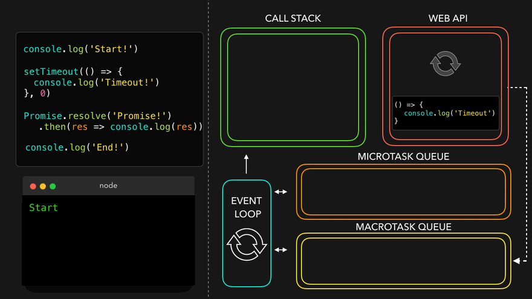

<!--
 * @Author: wangyunbo
 * @Date: 2021-08-17 11:22:33
 * @LastEditors: wangyunbo
 * @LastEditTime: 2021-08-17 13:15:06
 * @FilePath: \微任务\example.md
 * @Description: file content
-->
https://medium.com/gradeup/asynchronous-javascript-event-loop-1c8de41298dd

## Asynchronous Javascript (Event Loop)

Javascript is a single-threaded language at runtime which means only one thing can happen at a time. That is, the JavaScript engine can only process one statement at a time in a single thread. It also means you can’t perform long operations such as network access without blocking the main thread.That’s where asynchronous JavaScript comes into play. Using asynchronous JavaScript (such as callbacks, promises, and async/await), you can perform long network requests without blocking the main thread.
When you open a website in the browser, it uses a single JavaScript execution thread. That thread is responsible to handle everything, like scrolling the web page, printing something on the web page, listen to DOM events (like when the user clicks a button), and doing other things.
How can JavaScript be single-threaded and non-blocking at the same time?How about when we run timers? Loops?
How Does Asynchronous JavaScript Work?
To understand how this code is executed we have to understand event loop.
EVENT LOOP


Terminology used in JavaScript’s Event loop :
HEAP is the place (memory) where objects are stored when we define variables.
STACK which is a usual call stack that contains all called functions. When we call a function for its execution, we are pushing it into the stack. It is popped out of the stack when the execution is completed.


WEB APIs are responsible for filling the callback queue, providing many features such as the ability to make an AJAX request, setTimeout, DOM events.When we use these APIs, we utilise an event table. The event table keeps track of callbacks for their respective events. Once an event occurs, ie an asynchronous operation is completed, then the callback of that event gets enqueued into the callback queue.
CALLBACK QUEUE is also known as, Message Queue or Event Queue.With this queue, we have the callbacks from event table. The functions are waiting to be dequeued and put on the Call Stack.
EVENT LOOP is a process that checks whether call-stack is empty and does the callback queue contains pending task to process if it is — calls top event handler and removes it from queue.
The event loop understands this and makes sure that the callbacks from the Callback Queue are added to the Call Stack, once the Call Stack is empty.
The event loop, the web APIs and the callback queue are not part of the JavaScript engine, it’s a part of browser’s JavaScript runtime environment.
Execution of setTimeout


Refer fig 2.1- On the first line, the engine encounters the greet(). It gets added to the call stack, after which it logs the value . The method gets popped off the call stack. The engine encounters the setTimeout method, which gets popped on to the call stack.


Refer fig 2.2-setTimeout callback function will get added to the Web API, until the timer (1 sec ) is done.


Refer fig 2.3- Timeout callback gets added to the callback queue (macrotask queue) after 1 sec.


Refer fig 2.4 - The engine sees the call stack is empty now. setTimeout callback gets pushed on to the call stack.


Refer fig 2.5- The callback function return string.The setTimeout callback get popped.
ZERO DELAYS doesn’t actually mean the call back will fire-off after zero milliseconds. Calling setTimeout with a delay of 0(zero) milliseconds doesn’t execute the callback function after the given interval.

```js
const bar = () => setTimeout(() => console.log("Second")
, 0);
const foo = () => console.log("First");
bar();
foo();
```


Here First get log then Second The execution depends on the number of waiting tasks in the queue. The delay is the minimum time required for the runtime to process the request (not a guaranteed time).
Execution of Promises


In what order should the logs appear?
script start
script end
promise1
promise2
setTimeout
Why promise1 and promise2 get print before setTimeout?


ES6 Job Queue/ Micro-Task queue
ES6 introduced the concept of job queue/micro-task queue which is used by Promises in JavaScript. Macrotask or just called the task queue is code which needs to be executed after execution stack is empty. Macrotask are non blocking in nature. setInterval, setImmediate, setTimeout, I/O tasks, DOM Manipulation use the macrotask queue to run their callbacks. Promises, MutationObservers, IntersectionObservers etc. use the microtask queue to run their callbacks.The difference between the message queue and the microtask queue is that the microtask queue has a higher priority than the message queue, which means that promise jobs inside the job queue/ micro-task queue will be executed before the callbacks inside the message queue.


sync tasks → micro tasks → macro tasks


All functions in that are currently in the call stack get executed. When they returned a value, they get popped off the stack.
When the call stack is empty, all queued up microtasks are popped onto the. call stack one by one, and get executed! (Microtasks themselves can also return new microtasks, effectively creating an infinite microtask loop ).Microstask also execute at the end of each macrotask .
If both the call stack and microtask queue are empty, the event loop checks if there are tasks left on the (macro)task queue. The tasks get popped onto the call stack, executed, and popped off!
Microtask are kind of blocking in nature. Unlike macrotasks, the main thread will be blocked until microtask queue is empty.So if you keep queuing tasks in the microtask queue forever, your browser will become unresponsive. You can’t click a button, can’t scroll, nothing…, GIFs stop, animations stop etc.
Example Explain


Refer fig 4.1-On the first line, the engine encounters the console method. It gets added to the call stack, after which it logs the value start! to the console. The method gets popped off the call stack, and the engine continues.


Refer fig 4.2-The engine encounters the setTimeout , which gets popped on to the call stack.its callback function will get added to the Web API, until the timer is done. Although we provided the value 0 for the timer, the call back still gets pushed to the Web API first, after which it gets added to the macrotask queue.



Refer fig 4.3-The engine encounters the promise method. The promise method gets added to the call stack then its callback function will get added to the Web API . when promise resolve, its callback function gets added to the microtask queue.


Refer fig 4.4-The engine encounters the console method. It gets added to the call stack immediately, after which it logs the value End! to the console, gets popped off the call stack, and the engine continues.


Refer fig 4.5-The engine sees the call stack is empty now. it’s going to check whether there are queued tasks in the microtask queue! And yes there are, the promise then callback is waiting for its turn! It gets popped onto the call stack, after which it logs the resolved value of the promise.


Refer fig 4.6-The engine sees the call stack is empty, so it’s going to check the microtask queue once again to see if tasks are queued. Nope, the microtask queue is all empty.The setTimeout callback gets popped on to the call stack. The callback function returns the console method.The setTimeout callback get popped off the call stack.

Conclusion
So we have learned how asynchronous JavaScript works and other concepts such as call stack, event loop, message queue/task queue and job queue/micro-task queue which together make the JavaScript runtime environment.
That’s it and if you found this article helpful, please click the clap 👏button, and if you have any doubt, feel free to comment! I’d be happy to help .